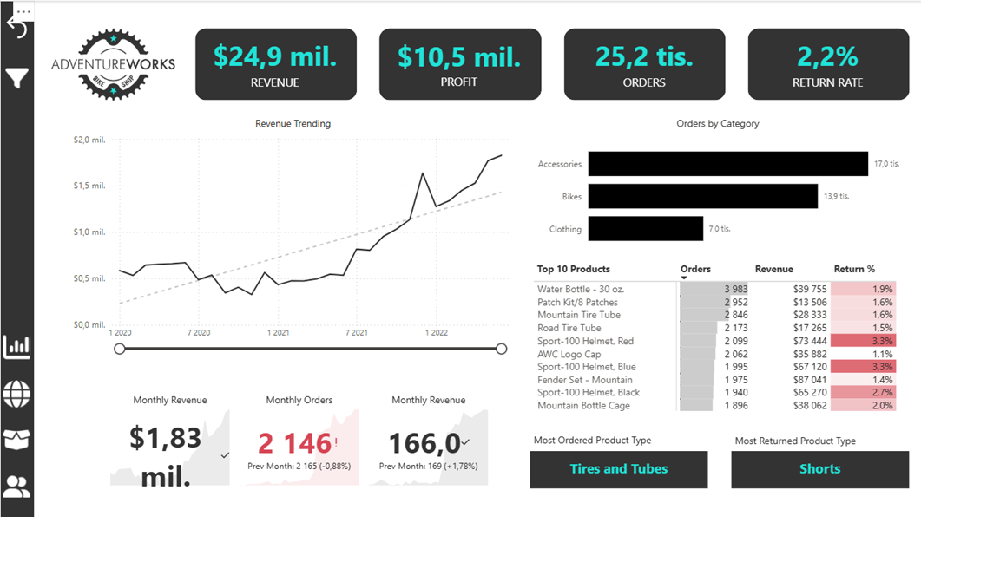

# Jan Pek — Power BI Portfolio

## O mně
Pracuji jako Production Intern v Philip Morris International
kde se zaměřuji na KPI analytiku a digitalizaci výrobních procesů.
Pomáhám firmám automatizovat reporty a vizualizovat data v Power BI.

📧 pekjcz@gmail.com
💼 www.linkedin.com/in/jan-pek

---

## Projekt 1 — Executive Sales Dashboard

**Nástroje:** Power BI Desktop, DAX, Power Query  
**Dataset:** Microsoft AdventureWorks

### Co dashboard obsahuje:
- KPI karty: Revenue, Profit, Orders, Return Rate
- Trendový vývoj tržeb v čase
- Top 10 produktů dle tržeb a návratnosti
- Geografická mapa objednávek
- Detail produktů a zákazníků
- Custom tooltip pro kategorie

### Screenshoty:

